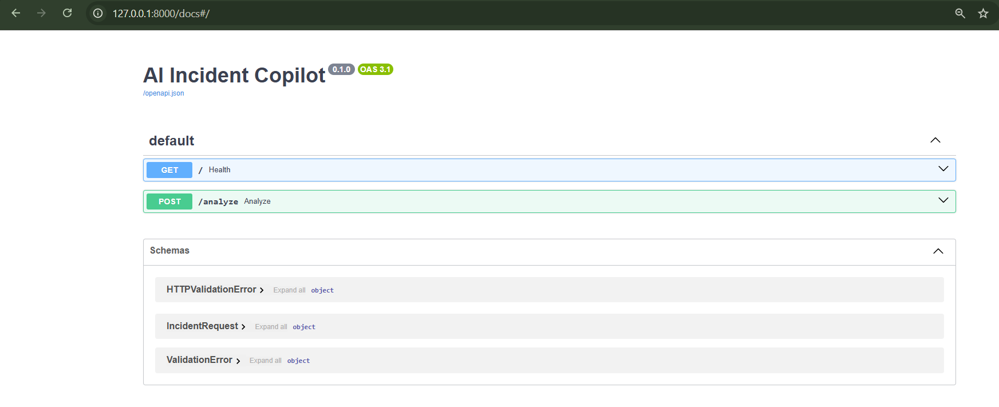
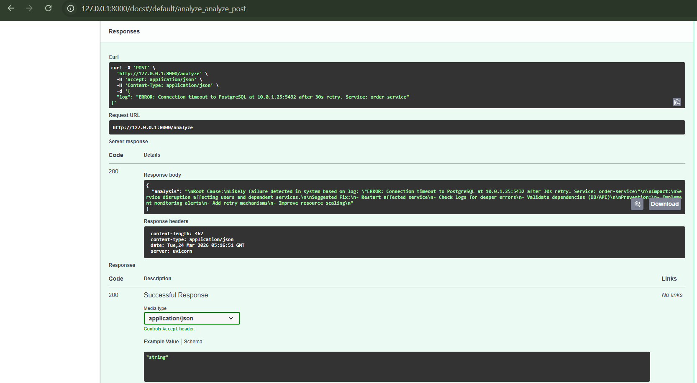
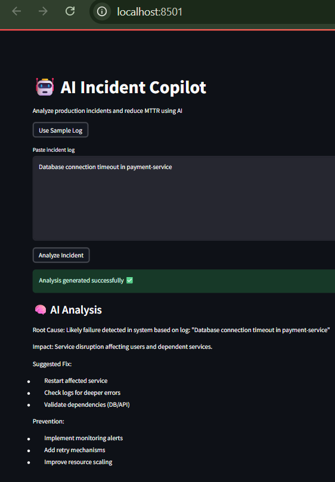

# 🚀 AI Incident Copilot

> AI-powered tool to analyze production incidents and suggest root cause, fixes, and prevention.

---

## 📌 Features

* AI-based incident analysis
* Mock fallback (works without API credits)
* FastAPI backend
* Streamlit UI

---

## 📸 Demo

### 🔹 API Documentation (Swagger UI)

### 🔹 API Response Testing

### 🔹 Streamlit UI (Frontend)

---

## 🧠 Use Case

Designed to help SRE and DevOps teams quickly analyze incidents and reduce MTTR using AI.

---

## 🛠️ Tech Stack

* Python
* FastAPI
* Streamlit
* OpenAI API

---

## 💡 Why this project

Built to simulate real-world SRE workflows and demonstrate how AI can accelerate incident resolution.

---

## 👨‍💻 Developed by

**Roshan Lal Sharma**

## ⚡ Powered by

**Akshay AGI LLP**
